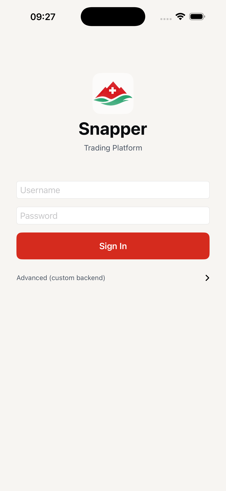
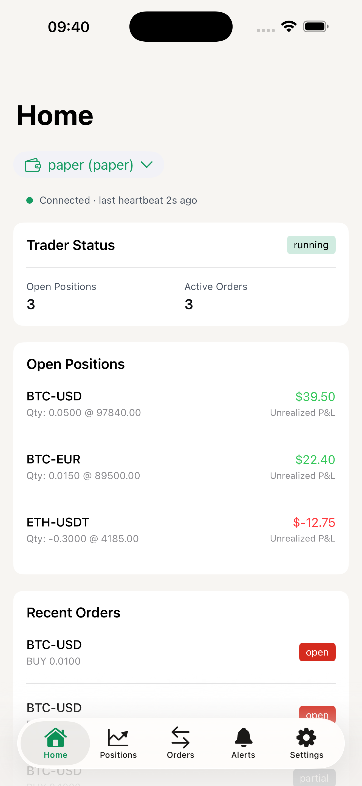
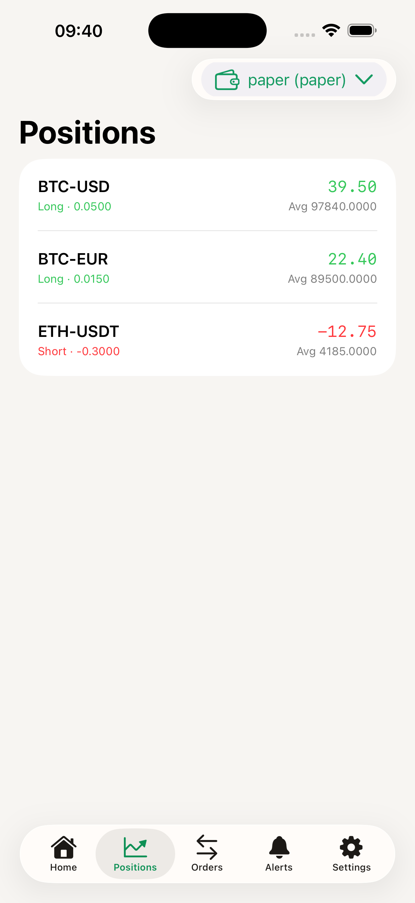
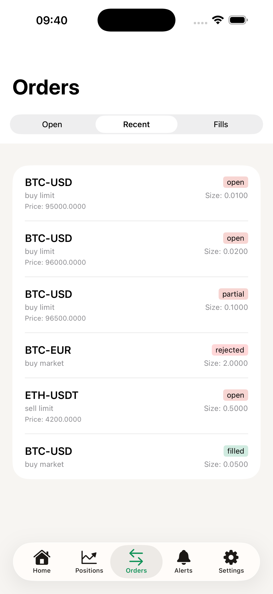
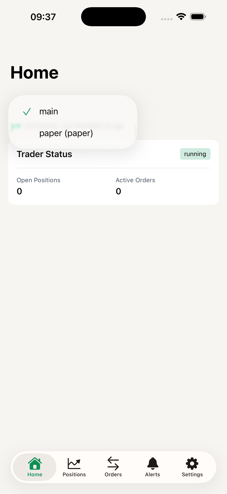
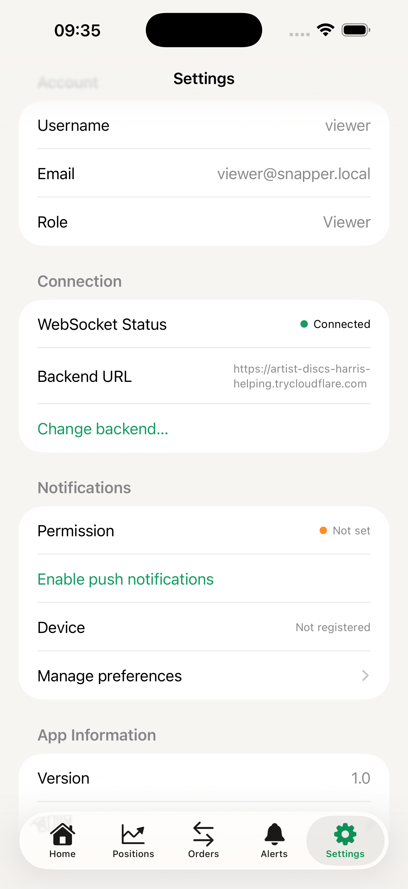
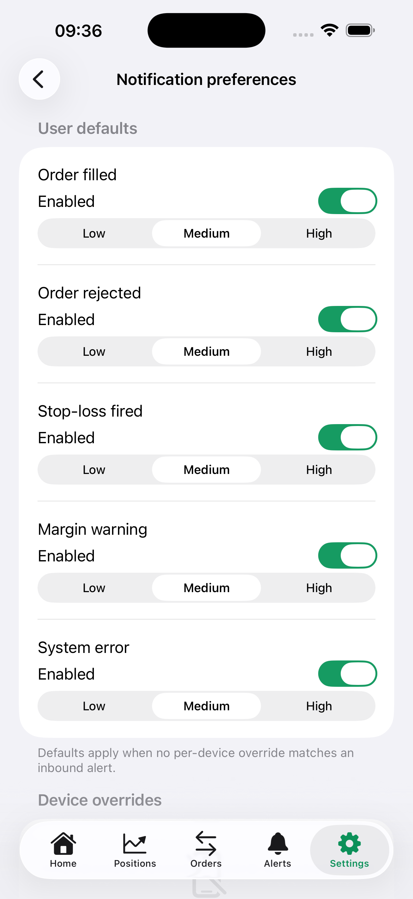

# Snapper iOS

Native iOS client for the [Snapper](https://github.com/mateusz-klatt/snapper) trading platform — a SwiftUI app that lets the maintainer run trading actions from a phone against a self-hosted Snapper backend.

## Status

- **v0.1.x** — Slice 1: order entry, cancel, brackets, trailing stops, alerts, push notifications, wallet picker. See [`CHANGELOG.md`](CHANGELOG.md) for the per-release breakdown.
- Public source mirror; the maintainer owns the App Store / TestFlight pipeline. Forks build for the simulator out of the box.

## Screenshots

Captured on iPhone 17 Pro Max (iOS 26.2) signed in as a viewer-role account against a local Snapper backend with a seeded paper-mode portfolio (3 open positions, 6 orders across statuses).















## Requirements

- macOS with **Xcode 26.2** (matches the iOS 26.2 SDK the deployment target requires)
- **XcodeGen** (`brew install xcodegen`)
- A running Snapper backend (the app defaults to `http://localhost:8000` — pair with `make dev-backend` from the parent repo)

## Build & test

```bash
make setup     # generates Snapper.xcodeproj from project.yml
make build     # iPhone 17 Pro simulator
make test      # full XCTest + Swift Testing suites
```

The Makefile uses sensible simulator defaults that match the GitHub Actions `macos-26` runner image. Override at the command line if needed:

```bash
make test SIMULATOR='iPhone 17' SIMULATOR_OS='26.2'
```

## Configure the backend URL

Three layers, evaluated in priority order:

1. **Runtime override (per-install, persisted in UserDefaults).** Self-hosters running the App Store binary set this from inside the app:
    - **Login → Advanced (custom backend)** disclosure for first-run / pre-authentication. Save persists immediately, no logout needed.
    - **Settings → Change backend…** for authenticated switches. Saving signs out, clears local app state, and routes the user back to LoginView pointing at the new URL.
2. **Bundled `Configuration.plist` BaseURL** patched at build time. Xcode Cloud's `ci_post_clone.sh` substitutes the production URL via the `SNAPPER_BACKEND_URL` secret; local builds keep the committed default (`http://localhost:8000`).
3. **Compiled-in fallback** if the plist is missing — also `http://localhost:8000`. `Environment.swift` validates the plist at startup and crashes loud in DEBUG when critical fields are missing.

The release build's runtime editor enforces the same rules `BackendURLStore.canonicalize` uses: origin-only URLs (no path / query / fragment / userinfo), no `ws://` / `wss://`, and `https://` only in App Store builds. Certificate trust itself is not validated in the editor — it is enforced at connect time by App Transport Security inside `URLSession`, and a connection to a backend without a publicly trusted certificate will fail then. Self-hosters running plain HTTP or self-signed backends must front them with an HTTPS reverse proxy (Caddy / nginx / Traefik / Cloudflare Tunnel) — the App Store binary cannot honor ATS exceptions or self-signed roots. DEBUG builds additionally accept `http://` for loopback (localhost / 127.0.0.0/8 / ::1) only.

## Architecture

- **Swift 6.0** with strict concurrency. Services use actors (`DeviceRegistrationService`) and `@MainActor` isolation (`AuthService`, `WebSocketManager`); cross-actor protocols are `Sendable`.
- **MVVM-with-pragmatic-View-fetching**: `LoginViewModel` is the textbook example; data-heavy tabs (`HomeView`, `OrdersView`, `PositionsView`) call `APIClient.shared` directly to keep the view-model layer minimal. v0.2.0 may tighten this.
- **Networking**:
  - `APIClient` — REST with one-shot 401-refresh-and-replay, generic `Decodable` body.
  - `WebSocketManager` — capped exponential backoff reconnect (300s ceiling), proactive `ws_token` refresh, terminal `.authFailed` state distinct from transient `.error`.
  - `EnvelopeMinter` — actor-isolated provenance stamper (per-app session id, separate control / telemetry counters, ms-precision ISO-8601). Mirrors the bridge's `integrations/snapper-mcp/src/envelope.ts` so backend gap detection sees a coherent session across iOS-originated commands.
- **Generated types** under `Snapper/Models/Generated/` are upstream-owned snapshots of the backend's OpenAPI + WebSocket schemas. External contributors cannot regenerate them without backend access — see [`docs/known-limitations.md`](docs/known-limitations.md).

## Continuous integration

GitHub Actions runs on `macos-26`:

- `ci.yml` — `make build && make test` on every push to `master` and every PR.
- `gitleaks.yml` — secret scan on push / PR / weekly cron.
- `sonarcloud.yml` — coverage scan via Xcode `xccov` → SonarCloud generic XML.

## Signing & release

A fork can build the unsigned simulator target without touching anything. To archive for a real device, set the team:

```bash
make archive DEVELOPMENT_TEAM=XXXXXXXXXX PRODUCT_BUNDLE_IDENTIFIER=com.example.snapper
```

The repo intentionally ships with `com.example.snapper` and no hardcoded team — the maintainer's TestFlight bundle id and team live outside the public source tree.

## Repository conventions

- All commits via fork-and-PR; see [`CONTRIBUTING.md`](CONTRIBUTING.md).
- License: [MIT](LICENSE).
- Security disclosures: [`SECURITY.md`](SECURITY.md).
- Architectural deep-dive: [`docs/architecture.md`](docs/architecture.md).
- Privacy policy (App Store): [`docs/privacy-policy.md`](docs/privacy-policy.md) — markdown source-of-truth; canonical published version served from [snapper.ch/privacy-policy.html](https://snapper.ch/privacy-policy.html).
